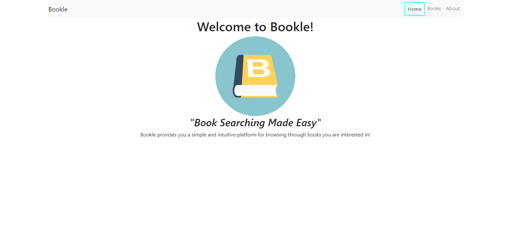
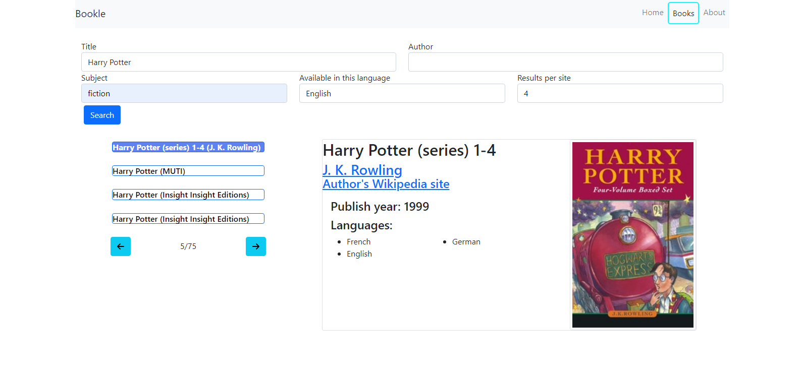
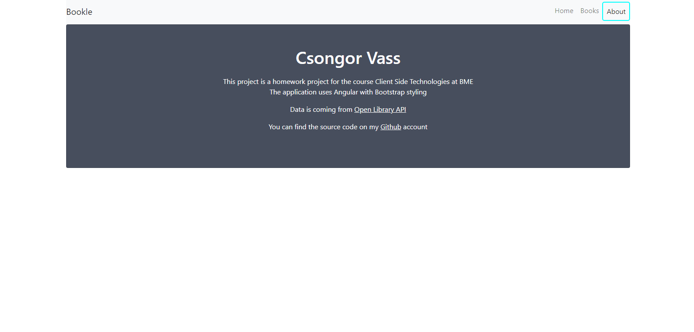

# Bookle

Bookle is a homework project made for Client Side Technologies at BME

Author - Csongor Vass (AHQQ3A)

Date - May 2022

## Features

*   Routing
*   Asynchronous searching for books
    * by title
    * by author
    * by subject
    * by language
    * with max results per site (for perforamnce)

   > Note: At least one of the first three is required for results

*   Query validation
*   Detailed view for selected books
    * Name of authors' with websites are links
    * Links for wikipedia for authors' with sites 
    * Cover image (higher resolution by clicking)

## Routes

* Home - landing page with a welcome message

* Books - page for the searching

* About - a short about page with some links

## References
 * Used api: https://openlibrary.org/developers/api
 * Logo base picture: https://shorturl.at/adjIZ 

